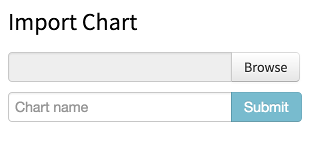

# Custom Regions Visualization

This custom visualization makes it easier for customers to create a map visualization in Zoomdata that uses customer specific map data.  Customers may have data sources with different fields, be interested in different parts of the world, use regions not defined by political boundaries, or a host of other configurations.

The regions map chart works by taking an aggregation in Zoomdata based on a field, where that field contains some region name.  The map finds a polygon with the same region name and colors it based on the associated metric.  For example, your data has a list of sales, each sale has an associated sales region name.  Something like

| sale | item | sales_region |
|---|---|---|
|200.00 | ostrich | northeast |
|50.00 | ocelot | midwest |
|300.00 | otter | south |
|300.00 | otter | northeast |


You need to have a GeoJSON that defines the polygons, and each polygon has an attribute.  The name of the attribute field does not have to be the same, but the _values_ must correspond to the data (case sensitive).  For our animal sales data we could have regions like this:


When displayed in Zoomdata the map would color the northeast region based on 2 rows, the central and south regions based on 1 row, if using Volume as the metric.  Or, it could color the same regions based on the sum of sales.

There are some edge cases that are not quite handled by this map.  The data may have values that don't have any match in the GeoJSON attributes.  This data would not be displayed at all.  This situation potentially affects the overall map, as the visualization limits the number of returned values from Zoomdata as the total number of polygons.

## Requirements
You need:

* A server runningZoomdata 2.3.5 (may work with later versions, at least minor 2.3.x releases)
* An account in Zoomdata with membership in the Administrators group, so you can access data source configuration and chart Studio
* The custom_regions.zip file, which contains the custom chart export from Zoomdata
* One or more GeoJSON files with your spatial data _(at this time TopoJSON is not supported)_.  Each shape must have a property containing some name or other identifier

**Note, the visualization supports GeoJSON with polygons (regions), points, and lines.  All features in a single GeoJSON source must have the same geometry type (don't mix points and polygons, etc)**
* A data source that has an attribute containing the same names as the property in the GeoJSON; the data source should already be configured in Zoomdata

## Installation

* Log in to Zoomdata
* Open Chart Studio
* Scroll down to the "Import Chart" section at the very bottom of the page



* Click "Browse" and navigate to the custom_regions.zip files
* Give your chart a meaningful name, this will be displayed when users are selecting the chart
* Click 'Submit'.  The chart should appear in the list of custom visualizations on the page
* Open the data source configuration page, click on the data source to associate with the map chart
* Click on the 'Charts' tab at the top of the page
* Click on the 'Custom' tab in the list of Charts
* Enable the newly added chart in the custom charts list
* In the chart configuration set the default fields.  In particular, configure the color palette/range you want to use (other values will be overridden in later configuration)
* Click 'Save'
* Return to Chart Studio
* Find the newly imported chart in the list and click the 'Edit' button in the same row
* Chart studio will display.  An error message will probably appear in the chart preview area.  Ignore it, do **not** click 'OK'
* Click on the 'Manage' drop-down on the toolbar of Chart Studio and select 'Libraries'
* Scroll down in the list until you see the '+Add' button, click '+Add'
* In the 'Uploda Library' dialog choose your Javascript file containing the GeoJSON data.  We recommend you set the Name to the same name as the file being uploaded.  Click 'Upload'
* Back in the 'Manage Libraries' dialog scroll down to the end and find the file you just uploaded; drag the file up to the 'Included Libraries' section at the top
* The imported library comes with 3 sample files (test_region_level3.js, test_region_level2.js, test_region_level1.js) containing GeoJSON, you can remove these files to clean up your chart code. Drag each file down to the 'Available Libraries' section
* Click 'Accept'

Now you need to set the map configuration to match your data.  The configuration defined in the 'userVariables' object sets the parameters for the map.  The `userVariables` parameters are all at the top of the `CustomRegionsMap.js` file.  The sample code as uploaded centers on the USA, uses OpenStreetMap, and has 3 layers of map data specified.

* Set `userVariables.initialExtent` as appropriate for your data.  The syntax is described in the setView method of the Leaflet documentation for the [map class](http://leafletjs.com/reference.html#map-class)
* Set your preferred base map service. Any base map service compatible with the Leaflet library can be used.  See the Leaflet [TileLayer documentation](http://leafletjs.com/reference.html#tilelayer) for specifics.  Include any API keys from the map provider as required.
* The `regionsConfig` object contains one or more definitions for a region.  You must define at least one region.
  * name of the variable containing the geoJSON
  * the zoom levels to display the layer
    * `minZoomLevel` is the lowest resolution level to show this data, where 0 is global.  For example, you wouldn't want postal codes displayed for the entire world, but continental or country borders are appropriate.  Default is 0.
    * `maxZoomLevel` is the highest resolution level to show this layer, where the maximum value is defined by the tile layer you specified previously.  The lowest level is usually neighborhood or local street level.  Defaults to the maximum zoom level supported by the tile server
  * name of the  property in the GeoJSON containing the shape name/id
  * name of the attribute in Zoomdata for the group corresponding to the data

Here is the userVariables object, as provided in the custom_regions sample:

```
#!javascript
var userVariables = {};
//Set the initial map extent.  This is what part of the world will be shown
//when the user first opens the visualization.  The extent consists of a
//center point lat/lon and a zoom level.  Zoom level is an integer between 0 and X, where
//0 is the whole world and X is the most detailed level as defined by the tile layer selected
//Some examples:
// United States (contiguous):
userVariables.initialExtent = {centerPoint: {lat:37.8, lon:-96}, zoomLevel: 4};
// Europe:
//userVariables.initialExtent = {centerPoint: {lat:53.87, lon:15.55}, zoomLevel: 4};
// Australia:
//userVariables.initialExtent = {centerPoint: {lat: -25.08, lon: 134.26}, zoomLevel: 4};


//Specify the tile layer to show in the background of the map using either the
//provider from leaflet-extras or by setting the parameters yourself

//Using leaflet provider, as described at https://github.com/leaflet-extras/leaflet-providers
userVariables.tileLayer = L.tileLayer.provider('OpenStreetMap.BlackAndWhite');

//Example setting the parameters manually, in this case for OpenStreetMap Mapnik
//userVariables.tileLayer = L.tileLayer('https://{s}.tile.openstreetmap.org/{z}/{x}/{y}.png', {
//	maxZoom: 19,
//	attribution: '&copy; <a href="http://www.openstreetmap.org/copyright">OpenStreetMap</a>'
//});

//Load and configure the regions to use for data display.  Regions must be in
//GeoJSON format.  Multiple regions can be set to show data at different zoom
//levels with different join fields.  This array must contain at least one element.
userVariables.regionsConfig = [{
    //The geoJSON containing the regions.  You _could_ put the whole geoJSON payload
    //here, but that might make things a bit difficult to read
    regionData: test_region_level1,
    //The chart needs 2 fields to render the data.  First, the field in the data
    //source containing the region name/id
    groupName: 'region_name1',
    //next, the name of the field in the geoJSON containing the same name/id
    regionField: 'name_1',
    //optionally you can set the min/max zoom levels for this layer
    //minZoomLevel not set, so will be shown out to global
    //if zoom levels overlap only the first one hit will be shown
    maxZoomLevel: 4 //won't show when zoomed in past level 10
},{
    regionData: test_region_level2,
    groupName: 'region_name2',
    regionField: 'name_2',
    minZoomLevel: 5,
    maxZoomLevel: 7
},{
    regionData: test_region_level3,
    groupName: 'region_name3',
    regionField: 'name_3',
    minZoomLevel: 8
    //maxZoomLevel not set, so will be shown all the way to most detailed
}];

/*
****************
End User Customization Section
Everything from here down is visualization logic
****************
*/

```


## Advanced Configurations
### Multiple Custom Region Visualizations

You can have multiple custom regions charts, each with a different set of regions or data source configurations.

#### Different Data Sources
The custom_regions chart that is loaded can be used against multiple data sources in Zoomdata, provided those data sources have the same field configuration for the region ID.  For example, one table contains sales_value while a different table tracks site_visits; both tables have a field named 'sales_region' with the same set of values.  Both of these sources can have the newly added visualization associated with them.

#### Different Regions

Repeat the import process to create a new custom visualization and perform the full customization for the map.  You will need to import the new GeoJSON files.

### Other versions of Zoomdata

This chart _should_ be compatible with Zoomdata version 2.2.x.  However, the custom visualization import process checks version numbers and does not allow the chart to be imported.  It is possible to create the custom visualization manually by following [these instructions](manual_vis_creation.md).

This wiki uses the [Markdown](http://daringfireball.net/projects/markdown/) syntax.
